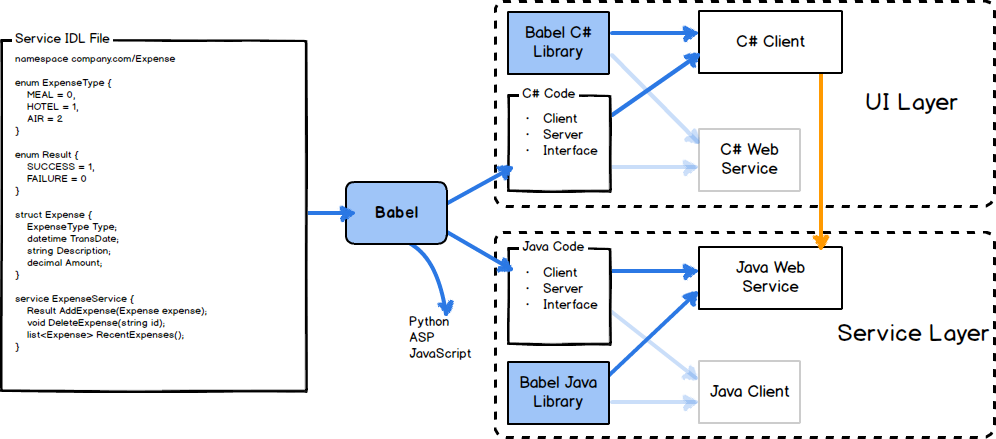

Babel is an IDL parser and RPC framework using JSON over HTTP. IDL files describe models and web services. The `babel` tool allows you to generate client and server code in multiple languages from the IDL file.

* [Babel RPC Home](http://babelrpc.io/)
* [FAQs](FAQ)
* [Best Practices](bestpractices)
* [Design Patterns](designpatterns)
* [JSON Serialization Notes](JSON)
* [Release Notes](history)

Best Practrices
---------------

Please look over the [best practices guide](bestpractices) once you are familiar with Babel. Also check out the [design patterns](designpatterns).

Supported Languages
-------------------

* [C#](https://github.com/babelrpc/lib-csharp)
* [Java](https://github.com/babelrpc/lib-java)
* [Test Harness](https://github.com/babelrpc/testharness)
* [ASP](https://github.com/babelrpc/lib-asp) (client only)
* [Go](https://github.com/babelrpc/lib-go) (server only)
* [Node.js](https://github.com/babelrpc/lib-js)

Overview of Using Babel
-----------------------

Babel Syntax
============

Babel's syntax should be familar to most programmers using C-like or JavaScript-like languages.

The Babel IDL File
------------------

A Babel file consists of a header and defintions. The header includes `import` and `namespace` statements. The rest of the file consists of `const`, `enum`, `struct`, and `service` declarations.

In general, the format is C-like. In most objects, a comma or semicolon is accepted as a separator, but isn't required.

In general, the parse tree of the IDL maintains the order of the items in the original IDL file.

### Comments

Ordinary comments are ignored by the parser.

	// This is a comment
	/* so is this */

### Documenation Comments

Documentation comments may appear *before* a `const`, `enum`, `struct`, or `service` definition. They may also be used before field and method definitions, and at the top of the babel file.

	/// This is a documentation comment
	/** So is this */

Documentation comments are written to the output files in a format appropriate for the language. File-level documentation comments (at the top of the babel file) are written to each generated output file. This is a good place to put overview or copyright information.

Make sure documentation comments are *awesome* for best results! They are placed into the generated code and any UIs we build for documentation purposes.

### Data Types

Babel supports various primitive data types. *Try to avoid types with a language-specific behavior unless you really know what you are doing.*

<table><thead><tr><th>IDL type</th><th>Examples (JSON)</th><th>Description</th><th>Range</th></tr></thead>
<tbody>
<tr><td>bool</td><td>false, true</td><td>Boolean</td><td>false, true</td></tr>
<tr><td>byte</td><td>0, 1, ...</td><td>Unsigned 8-bit integer</td><td><b>Warning: Language-specific behavior!</b> 
0 to 255 
Java: 0 to 127</td></tr>
<tr><td>int8</td><td>-1, 0, 1, ...</td><td>Signed 8-bit integer</td><td>-128 to 127</td></tr>
<tr><td>int16</td><td>-1, 0, 1, ...</td><td>Signed 16-bit integer</td><td>-32,768 to 32,767</td></tr>
<tr><td>int32</td><td>-1, 0, 1, ...</td><td>Signed 32-bit integer</td><td>-2,147,483,648 to 2,147,483,647</td></tr>
<tr><td>int64</td><td>"-1", "0", "1", ...</td><td>Signed 64-bit integer</td><td>-9,223,372,036,854,775,808 to 9,223,372,036,854,775,807</td></tr>
<tr><td>float32</td><td>3.14</td><td>Floating point with 32-bit precision</td><td>-3.402823e38 to 3.402823e38</td></tr>
<tr><td>float64</td><td>3.14159</td><td>Floating point with 64-bit precision</td><td>-1.79769313486232e308 to 1.79769313486232e308</td></tr>
<tr><td>string</td><td>"\thello, world"</td><td>String, assumed to be UTF-8 or Unicode capable</td><td>0 to any number of characters</td></tr>
<tr><td>datetime</td><td>"2013-09-09T13:44:22.341-05:00" "2013-09-09T18:44:22.341Z"</td><td>Date-time type. (Date constants are not supported.)</td><td>Specific range outside of 1980s and up varies by language</td></tr>
<tr><td>decimal</td><td>"3.2415"</td><td>128-bit decimal data type (Decimal constants are not supported.)</td><td>
<b>Warning: Language-specific behavior!</b> 
ASP: -922,337,203,685,477.5808 to 922,337,203,685,477.5807 
.Net: &#x00B1;1.0&times;10e-28 to &#x00B1;7.9&times;10e28 
Java:  
Other: Represented as a string</td></tr>
<tr><td>char</td><td>"\r", "A"</td><td>Single character, assumed to be UTF-8 or Unicode capable</td><td>Single character</td></tr>
<tr><td>binary</td><td>"YXNhZGFzZAo="</td><td>Binary data stored in byte arrays (based64 encoded string)</td><td>0 bytes to any number of bytes</td></tr>
</tbody></table>

Primitive types are generally nullable (i.e. optional). Initializers may be used to ensure that a field has a default value.

Finaly, the `binary` type is used to represent binary data stored in byte arrays. It serializes more efficiently than a list of bytes.

(Also see [Language-Specific Issues](langissues) and [About JSON](JSON).)

#### Containers

Maps and lists may be defined.

A list can contain primitive types or complex types defined by a `struct`. Lists may contain null values.

A map's key can only contain primitive types, but the value can contain any type. Null keys are not supported. Values set to null are not guaranteed to be preserved across the wire.

<table><thead><tr><th>IDL type</th><th>Examples</th><th>Description</th></tr></thead>
<tbody>
<tr><td>list</td><td>list&lt;int32&gt; list&lt;Foo&gt; list&lt;list&lt;string&gt;&gt;</td><td>A list of values</td></tr>
<tr><td>map</td><td>map&lt;int32,string&gt; map&lt;string,Foo&gt; map&lt;string,list&lt;int32&gt;&gt;</td><td>A map or dictionary</td></tr>
</tbody></table>

#### Initializers (Defaults)

In the data model generated for any given language, maps and lists are automatically initialized to an empty, non-null container. Manually nulling out a container may cause Babel's Protocol (serialization) layer to generate an exception.

Initializing primitive types has the simple effect of a constructor initializing the value. Because Babel's types are all nullable, this helps ensure that callers do the right thing. However, the server code should still check for null in its validation step.

That being said, when a field is nulled out but has a default value, the server will still see the default value. This is because the JSON (and other protocols) tend to minimize the data sent via the transport. If a field is null, it is not sent over the wire.

When the server parses the JSON, the model is initialized. Since the JSON doesn't contain a definition for the null field, it is never assigned and the default value is used. Think of initializers as a way to set a default value.

**NOTE** - the following IDL primitive types do not support initializer values: `datetime`, `decimal`, and `binary`.

### Attributes

Attributes can be placed on `struct`, `field`, `service`, and `method` definitions.

	[MessageId("OperatedBy", MessageCategory = "View"),
	 ValidateStringLength(MaxLength = 32), ValidateRequired]

Multiple attribute blocks can be used over a single item:

	[Foo]
	[Bar]

#### Scopes

Attributes may be used with a scope. When a scope is defined, the attributes can be passed-through by the code generator if the scope is enabled on the babel command line.

	@myScope [MyAttribute]

Attributes without scopes are reserved for use by Babel.

**Note:** Babel does not automatically add import statements for pass-through attributes. Thus, you will usually need to specify their full namespace:

	@validate [Validator.ValidateRequired]

### import

Use the import statement to load another IDL file into this one. Imports must occur at the top of the IDL file and are relative to the current file. Use a forward slash as a directory separation (this way it works across platforms).

	import "tower/includeMe.babel"

Symbols must be unique across all files. While output namespaces are supported, it is assumed that all of the symbols will be unique across those namespaces.

### Default namespace

A default namespace is used to avoid specifying it for all languages. _The default namespace is required_ and is written like a URL. Examples:

	namespace company.com/Tower/Babel
	namespace company.co.uk/Tower/Babel

This maps to different languages as shown in the following example.

<table><thead><tr><th>Language</th><th>Result</th></tr></thead><tbody>
<tr><td>java</td><td>com.company.tower.babel</td></tr>
<tr><td>csharp</td><td>Company.Tower.Babel</td></tr>
<tr><td>asp</td><td>TowerBabel</td></tr>
<tr><td>python</td><td>TowerBabel</td></tr>
<tr><td>ruby</td><td>TowerBabel</td></tr>
<tr><td>ios</td><td>BAB</td></tr>
<tr><td>php</td><td>TowerBabel</td></tr>
<tr><td>javascript</td><td>TowerBabel</td></tr>
<tr><td>go</td><td>company.com/tower/babel</td></tr>
</tbody></table>

### Language-specific namespace

The `namespace` statement is used to define the namespace for a given language (see supported languages above).

	namespace csharp "Company.Tower"

Babel doesn't validate these. In fact, babel assumes that all of the symbols that are defined are unique across all included files.

### enum

Enumerated types may be defined with their associated values.

	/// Enumeration of supported languages
	enum Languages {
		ENGLISH = 1,
		GERMAN = 2
	}

Enumerated types must specify their integer values and cannot reference other enums or constants.

Enumerations can be used as initializers for enum fields and parameters.

### const

Constants can be defined for chars, integers, doubles, booleans, and strings. Constants must be unique within their declaration block.

	/// Miscellaneous Constants
	const Misc {
		COUNT = 50;
		PI = 3.14159;
		Email = "michaell@company.com";
		EmailValid = false;
	}

Constants can be used to initialize fields and parameters, provided that the data type matches.
`All decimal constant values become datatype of double, so you can only use these constants to initialize fields of type double.`

### struct

A structure defines the fields that will be transmitted in web services calls. Fields may have primitive data types or be other structures.

Structures and fields within them both support docmentation comments and attributes.

	/// Documentation comment for Bar
	[MessageCategory("Travel")]
	struct Bar {
		datetime C
		/// D is for David
		/// Or so you would think
		[SomeAttribute()]
		list<Bar> D;
		[ValidateRequired, ValidateRegularExpression(Pattern = "[A-Za-z0-9]{2,2}")]
		string XXX = "foo"
		/** YYY is funny */
		[ValidateStringLength(MaxLength = 32),
		ValidateRequired]
		string YYY
		[Lang(ID="ok")]
		Info E
		Foo State = Foo.OFF
		Foo2 Name
		list<string> F
		map<int32,string> X
		map<int32,Info> Y
		map<string,list<Info>> Z
		int32 SomeInt
	}

Structures may be defined as `abstract`. See below for more information.

#### Composing Data Structures

Structures can be composed by extending other structures, so that they have all of the base fields. This is done with the `extends` keyword.

	abstract struct Bar {
		// fields
	}

	struct Foo extends Bar {
		// fields
	}

Object composition is different from a traditional object-oriented language in several ways. Babel is designed to create *data transfer objects* for passing data around web services. It's not an object-oriented format per se - instead it is focused on easily composing your data. That being said, it does generate a class hierarchy in most languages that support it.

Key differences you will note:

* Unlike OO languages, polymorphism is **not** supported. Thus, `list<Bar>` will never have a `Foo` object in it. This is a very important distinction.
* Overriding fields is *not* supported. All fields across the entire inheritance chain must be uniquely named.
* The is no concept of *virtual* members or anything similar.
* No multiple inheritance.
* The `abstract` keyword prevents any field from using the struct as its type. Additionally, code generators may use the keyword to generate abstract classes.

##### Why no polymorphism?

Polymorphism might be supported in the future, but we felt that it adds unnessessary complexity and might even lead to bad DTO designs.

* JSON serializers are far more complex (and slower) when supporting polymorphism.
* Polymorphism is not supported by all target languages.
* Major, industry-proven tools like Thrift and Protocol buffers don't support it.

We want to see how use of Babel evolves. While we recognize some very well-known cases like travel segments, the vast majority of use cases may not need it.

##### Design Alternatives

Since this polymorphic case *won't* work:

	struct Trip {
		list<Segment> Segments;
	}

A common alternative is:

	struct Trip {
		list<AirSegment> AirSegments;
		list<HotelSegment> HotelSegments;
		list<CarSegment> CarSegments;
		// etc.
	}

This alternative is, interestingly enough, how the TripIt API works. It's a good model when you don't know who is using your service and what tools they are using.

Please keep in mind that the client libraries generated by Babel can be used with polymorphism or "duck typing" in your code - just not in the DTO objects themselves. For instance, you could create a list of `Segment` objects and sort them in your code. They just can't go over the wire that way.

Other alternatives involve using a single `Segment` type:

	struct AirProperties {}
	struct HotelProperties {}
	struct CarProperties {}

	struct Segment {
		// Common Properties
		AirProperties Air;
		HotelProperties Hotel;
		CarProperties Car;
	}

	struct Trip {
		list<Segment> Segments;
	}

### service

Defining a service involves listing the methods that are available on the service. The `service` definition and the methods both support documentation comments and attributes.

	/** Service description */
	service TokenGenerator {

		/// Get a token
		Foo GetToken();

		/// Post a token
		Foo PostToken(Foo token);

		/// Validate a token
		Foo ValidateToken(
			/// token specified
			int64 tokenId,
			/// Application
			string application
		)
		
	}

For services and methods, there are specific attributes that are used to generate the output. Methods may be declared with a `void` return type if they don't return data.

Using Babel
===========

The Babel Binary
----------------

### Installation

The only required files are the babel binary and the template folder. Babel has minimal dependencies - just a few shared libraries that should already be on the operating system.

The location of the templates folder is based on the location of the babel binary. `/usr/bin` and `/bin` locations are replaced with `/etc` - so effectively, the templates folder is located in the `etc` folder that corresponds to the `bin` folder. If the binary is not in a `bin` folder, then the templates folder is expected to be in the same folder as the binary. Some examples are shown below.

<table><thead><tr><th>babel binary location</th><th>Default template folder location</th></tr></thead><tbody>
<tr><td>/bin/<strong>babel</strong></td><td>/etc/<strong>babeltemplates</strong></td></tr>
<tr><td>/usr/bin/<strong>babel</strong></td><td>/etc/<strong>babeltemplates</strong></td></tr>
<tr><td>/usr/local/bin/<strong>babel</strong></td><td>/usr/local/etc/<strong>babeltemplates</strong></td></tr>
<tr><td>/usr/local/bin/babel/<strong>babel</strong></td><td>/usr/local/etc/babel/<strong>babeltemplates</strong></td></tr>
<tr><td>/usr/local/babel/bin/<strong>babel</strong></td><td>/usr/local/babel/etc/<strong>babeltemplates</strong></td></tr>
<tr><td>c:\babel\bin\<strong>babel.exe</strong></td><td>c:\babel\etc\<strong>babeltemplates</strong></td></tr>
<tr><td>c:\files\<strong>babel.exe</strong></td><td>c:\files\<strong>babeltemplates</strong></td></tr>
<tr><td>/home/michaell/<strong>babel</strong></td><td>/home/michaell/<strong>babeltemplates</strong></td></tr>
</tbody></table>

### Command-Line Parameters

<table><thead><tr><th>Option</th><th>Default</th><th>Description</th></tr></thead><tbody>
<tr><td>-templates</td><td><em>babeltemplates (as shown above)</em></td><td>Use to override the location of the templates folder</td></tr>
<tr><td>-help</td><td>false</td><td>Show command help</td></tr>
<tr><td>-json</td><td>false</td><td>Print the JSON representation of the IDL parse tree</td></tr>
<tr><td>-lang</td><td>csharp</td><td>Generate code in the given language</td></tr>
<tr><td>-output</td><td>gen-lang</td><td>Output folder for generated files</td></tr>
<tr><td>-inc</td><td>false</td><td>Generate included files too</td></tr>
<tr><td>-ns</td><td></td><td>Optionally matches files only if namespace starts with this</td></tr>
<tr><td>-scopes</td><td></td><td>Comma-separated list of scopes to enable</td></tr>
<tr><td>-options</td><td></td><td>Comma-separated list of key=value pairs for generator</td></tr>
<tr><td>-version</td><td></td><td>Display the version number</td></tr>
</tbody></table>

Development
===========

Design
------

Babel contains a parse tree [idl.go](https://github.com/babelrpc/babel/blob/master/idl/idl.go), and a [yacc](http://golang.org/cmd/yacc/) file [parseidl.y](https://github.com/babelrpc/babel/blob/master/parser/parseidl.y) that implements the parser. The lexical scanner is Go's own [text scanner](http://golang.org/pkg/text/scanner/) which tokenizes input for C-style languages.

Output is generated using Go's [template package](http://golang.org/pkg/text/template/).

### Syntax Files

Babel supports a few [syntax highlighters](https://github.com/babelrpc/syntax).
