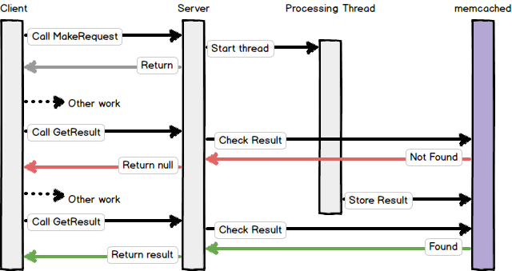

Here are a few design patterns for Babel web services.

* <a href="#callouts">Callouts</a>
* <a href="#clientasync">Client-based Asynchronous Processing</a>
* <a href="#factory">Client Factory</a>
* <a href="#sendforget">Send and Forget</a>
* <a href="#polling">Asynchronous with Polling</a>
* <a href="#pingpong">Ping-Pong (Asynchronous with Notification)</a>
* <a href="#proxy">Proxy</a>
* <a href="#wrapper">Proxy Wrapper for Asynchronous Conversion</a>
* <a href="#callyourself">Calling Yourself</a>
* <a href="#headers">Using Headers in a Service Object</a>

Callouts
--------

A _callout_ is sort of a reverse-service. Normally, a service designer creates the Babel file that defines the service data and endpoints.

For a callout, the client of the service designs the service endpoint with the intention of calling a user-defined service that meets the specification. It might be have a configured list of URLs to invoke the service call on.

Callout designers must be careful with versioning. Changes to the service API may or may not be implemented by the clients; therefore it is recommended to create new versions of endpoints and configure which versions to use.

Suppose I am writing a callout that reads a queue of changes and posts the changes to a list of configured URLs. I might define my service as follows:

	/// Information about the service implementation
	const CalloutInfo {
		VERSION = 2
	}

	/// Data provided to the callee
	struct CalloutData {
		// some data
	}

	/// Callout service definition
	service CalloutService {
		/// GetVersion returns the currently supported service
		/// version. We call this at startup to determine which
		/// method to use.
		int32 GetVersion();

		/// Performs the action given the callout data.
		/// Supported by version 1.
		bool PerformAction(CalloutData data);

		/// Performs the action given the callout data. If
		/// verbose is true, then verbose logging is done.
		/// Supported by version 2.
		bool PerformAction2(CalloutData data, bool verbose);
	}

When my queue reader starts up, it queries each URL by calling `GetVersion` to determine what service version it supports. Then it will only call the appropriate method.

Note that the implementation of `GetVersion` simply returns `CalloutInfo.VERSION`. Whenever the service is upgraded, it automatically reports the correct version.

Client-based Asynchronous Processing
------------------------------------

In some languages the Babel client supports asynchronous versions of service methods. These methods allow you to do other processing during the HTTP request to the Babel service. So rather than calling:

	var x = client.DoSomething();

you would call:

	var asynchObj = client.StartDoSomething();
	// ... some other code can run
	var x = asyncObj.GetResponse();

It should be noted that the specifics of the implementation are language-dependent. In most languages it is recommended to call `GetResponse` to complete the HTTP sequence correctly.

Client Factory
--------------

To centralize configuration and setup we recommend creating client factories. For this simple service:

	service FooService {
		int32 GetCount();
	}

using the client might look like:

	var c = new FooServiceClient();
	c.InitHttp("http://localhost/Foo", 30);
	c.SetHeader("X-LOGGING-LEVEL", "warning");
	var x = c.GetCount();

A more robost approach is to create a client factory that performs all the needed initialization:

	var c = Factory.FooClient();
	var x = c.GetCount();

This makes it easy to change the URL (which should be in a config file anyway) or add new initialization steps in one place.

The factory might be implemented as a static class with methods for various kinds of `service` entries.

	public class Factory
	{
		public static FooServiceClient FooClient()
		{
			var c = new FooServiceClient();
			c.InitHttp("http://localhost/Foo", 30);
			c.SetHeader("X-LOGGING-LEVEL", "warning");
			return c;
		}

		public static BarServiceClient BarClient(int32 userId)
		{
			var c = new BarServiceClient();
			c.InitHttp("http://localhost/Bar", 15);
			c.SetHeader("X-LOGGING-LEVEL", "error");
			c.SetHeader("X-CALLER", userId)
			return c;			
		}
	}

In some cases you might want to totally encapsulate the use of the client inside some wrapper class.

Send and Forget
---------------

A send-and-forget service implements a method that returns immediately after laucnhing a thread to do the processing. The client will receive no confirmation that the processing was successful.

	/// Send and forget
	service ForgetMeService {
		/// Log the provided data
		void LogSomething(Something data);
	}

The client doesn't see any difference except that failure to correctly perform the action is not visible to it.

Asynchronous with Polling
-------------------------

Sometimes we want to multitask while waiting for a response. A simple way to achieve this is with a non-blocking send and polling response.

	/// Polling service
	service PollingService {
		/// Starts the request and returns a "token" to
		/// check on the result later
		string MakeRequest(RequestData data);

		/// Returns the result, or null if the request isn't done yet
		ResponseData GetResult(string token);
	}

The client begins by calling `MakeRequest`, at which time the server starts a processing thread and immeidately returns a token that is used to check on the response later. The client can now do other processing and occassionally check whether the service is complete by calling `GetResult`.

It is important that services implemented this way are not impacted by the failure to call `GetResult`. The client might abandon the request if it takes too long, or perhaps the client would be interrupted or abnormally terminate. We wouldn't want resources lying around.

Frequently this pattern is implemented by storing the result in memcached, allowing it to expire in 15 minutes or so.

Polling too frequently can impact system performance.

Ping-Pong (Asynchronous with Notification)
------------------------------------------

Ping-pong is a normal service call combined with a callback. It can be used for asynchronous processing with a notification when complete. It consists of two service contracts.

	/// NotifyService is implemented by the client and called by
	/// the processing service
	service NotifyService {
		/// Notifies the client when processing is done.
		void Notify(NotifyInfo data);
	}

	/// ProcessingService performs work and then notifies the client when done
	service ProcessingService {
		/// Begins processing the data. When complete, calls
		/// the client on the given callbackUrl using the
		/// NotifyService contract.
		void StartProcessing(ProcessingInfo data, string callbackUrl);
	}

When using this design, the client should remain stable even if the processing service fails to ever call it back. That being said, the processing service should be designed so that it won't fail to do so.

Proxy
-----

A proxy service simply forwards the request to another service. It does so by implementing the service's interface and forwarding the request to the original service.

	service OriginalService {
		void DoIt(Data data);
	}

In this example I can create a proxy service that implements the `OriginalService` contract by forwarding each request to the original service.

A variety of this pattern allows you to specify the forwarding URL dynamically. Although you could put it in the service definition, a better approach is to use Babel headers to store a header that specifies where the proxy should send the request to.

	var client = new OriginalServiceClient(proxyUrl, 30);
	client.SetHeader("X-PROXY-TO", originalUrl);
	client.DoIt(data);

Note that you should choose a header name that is consistent with your project and doesn't conflict with HTTP headers.

Proxy Wrapper for Asynchronous Conversion
-----------------------------------------

If your client code can't support asynchronous processing, you can create a proxy to wrap up a service and make it asynchronous. If the original service implements:

	service OriginalService {
		Response DoIt(Data data);
	}

You can create a proxy wrapper service:

	service WrapperService {
		/// Start the request and return a token to check the response
		string StartDoIt(Data data);

		/// Get the response or null if it isn't finished.
		Response GetResponse(string token);
	}

This example illustrates the polling technique, but other methods could be used.

It's far easier to use a client that supports asynchronous use directly, or implement asynchronous methods in the server code. But in a pinch a proxy can do the trick.

Calling Yourself
----------------

The _service object_ model allows your service implementation to be abstracted away from the web framework. Thus, you can instantiate your service objects and call them directly using the models generated with Babel.

Because of this, it's recommended that service validation lives inside your service objects rather than at a web tier.

Calling your own objects is useful in situations where you want to compose a service based on other endpoints, or if you need to write a batch processor as a part of your service's functionality and it needs to invoke your library directly.

Using Headers in a Service Object
---------------------------------

The interface for a service object doesn't include headers. To use headers, you need to make them available to the service object.

	service MyService {
		void DoIt();
	}

The service object might look like:

	public abstract class MyServiceBase
	{
		// The request ID for logging
		protected string mRequestId;

		public MyServiceBase(IDictionary<string, string> headers)
		{
			mRequestId = headers["X-REQUEST-ID"];
		}
		public MyServiceBase(string requestId)
		{
			mRequestId = requestId;
		}
	}

	public class MyServiceObject : IMyService, MyServiceBase
	{
		public MyServiceObject(IDictionary<string, string> headers) : base(headers)
		{
		}

		public MyServiceObject(string requestId) : base(requestId)
		{
		}

		public void DoIt()
		{
			LogSomething(mRequestId, "Hello");
		}
	}

When the service object is assigned to the controller, you can also deal with headers.

	public partial class MyServiceController
	{
		protected override IMyService InitBusinessLogic()
		{
			return new MyServiceObject(Request.Headers);
		}
	}

This is example is not meant to be something you should just copy. The point is to show how headers can be transmitted to the service object, and to avoid code using thread-local objects like a session as a global variable. If the code is littered with access to global data, it becomes difficult to understand how to use the library outside of the web framework, and it tempts people to create hacks where they pass data around in globals.

