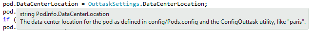
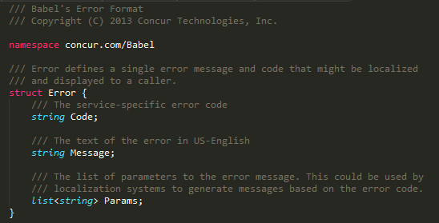
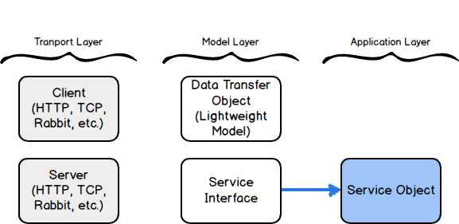

Babel is a tool for defining web service interfaces in a compact way and generating client and server code in multiple programming languages. It helps produce consistent, discoverable, and easy to consume web services.

## Why Babel?

It takes a serious effort to product great web services.

* Documenting services is challenging.
* Services often use different styles - SOAP, plain XML, RESTish, etc.
* Test harness pages are manually created, if they exist at all.
* When client libraries exist, they are only for one programming language.
* There is no good way for developers to browse or discover services.
* Service response codes vary widely.

Additionally, developers spend way too many hours writing all the components of a service call.

## Enter Babel

Babel starts with a contract - an "interface definition language" file (or "babel file"). The babel file can be fully documented and immediately used to generate server code, client code, and a test harness. Babel supports multiple programming languages, so you can generate your server components in Java and your client components in C#.

## Based on Standards

Babel uses JSON over HTTP for all calls. While not a strictly RESTful API, Babel's APIs conform to web standards and can easily be called from code where Babel clients could not be used.

## Full Documentation

Documentation comments from the babel file are written to all the generated code and test harnesses, enabling IDEs to display help for developers.

## Test Harness

Each API gets a fully working test harness (including documentation) so that you can try out the API by hand.

## Syntax Highlighting

Babel supports syntax highlighting in Eclipse, Visual Studio, and Sublime Text 3.

## Built on a Proven Ideas

Babel is similar to Facebook's [Thrift](http://thrift.apache.org/) and Google's [Protocol Buffers](https://developers.google.com/protocol-buffers/). Why a new tool? Because we wanted web-standard APIs with awesome test harnesses. And, a focus on documentation as a core value.

## Powerful Features

Babel lets you define constants, enumerations, structures, and services. The Babel runtime libraries let you customize metrics, error logging, error mapping, and more. Check out the [documentation](/babel.html) to learn more.

## Service Object Architecture

The Babel runtime libraries allow you to separate your service implementation from any web framework sitting on top of it. This design is more flexible and allows you to use your core functionality in other contexts.

## Multi-Platform

In addition to supporting multiple languages, Babel runs on Linux, Mac, and Windows.

## Babel Documentation

[Documentation](/babel.html) - learn about the Babel software
[Frequently Asked Questions](/FAQ.html) - get answers to common questions
[Best Practices](/bestpractices,html) - understand how make the most of Babel
[Design Patterns](/designpatterns.html) - learn how to solve service design problems
